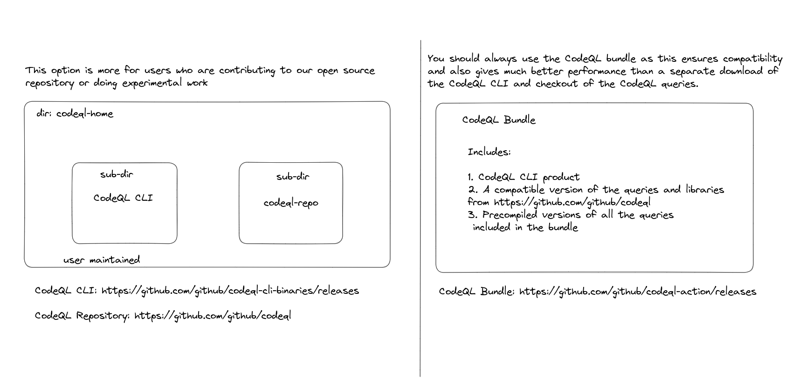

# CodeQL Query Packaging and Versioning

## CodeQL CLI versus CodeQL Bundle

## Query Packs 

This is how we develop and distribute queries 

There are two types of CodeQL packs

- Query packs are designed to be run. When a query pack is published, the bundle includes all the transitive dependencies and pre-compiled representations of each query, in addition to the query sources. This ensures consistent and efficient execution of the queries in the pack.

- Library packs are designed to be used by query packs (or other library packs) and do not contain queries themselves. The libraries are not compiled separately.

## qlpack.yml is how we create query packs 

`qlpack.yml` must exist in the root directory. 

`name:` field is mandatory with format `<scope>/<pack>` where `<scope>` is GitHub organization or user account that the pack will be published to and `<pack>` is the name of the pack

Any custom queries that you want to add to a query suite must be in a CodeQL pack and contain the correct query metadata.

## codeql pack init 

Initializes a qlpack in the specified directory 

The pack will be in a child directory of specified repo

Available from v 2.6.0

`codeql pack init [--dir=<dir>] [--extractor=<extractor>] <options>... -- <package-name>`

`<package name>` - mandatory
 scope and name of the pack to create. Scope is only required if pack is to be published.

If you are stuck you can always run --help command after any of the CodeQL CLI instructions

Example: `codeql pack init --help`

## codeql pack add 

Adds a list of QL library packs with optional version ranges as dependencies of the current package, and then installs them.

`codeql pack add “codeql/java-all@latest” `

## Add Tests to your queries 

`codeql pack init advanced-security-demo/custom-java-tests --extractor=java`

Add dependency from test pack to query pack 

## codeql pack install 

Install dependencies for this pack.

This command installs the dependencies of the pack. 
   - If a codeql-pack.lock.yml exists, the versions specified in that lock file will be installed if  they are compatible with the version constraints specified in the qlpack.yml file. 
   - If any dependency versions specified in the lock file are incompatible with this pack's constraints, this command will install the latest compatible version of each of those dependencies, updating the lock file with the newly chosen versions. 
   - If no lock file is present, this command installs the latest compatible version of all dependencies, creating a new lock file.

`codeql-pack.lock.yml` are automatically generated and should not be manually added 

## CodeQL Workspace 

You use a CodeQL workspace when you want to group multiple CodeQL packs together. 

The provide block contains a list of glob patterns that define the CodeQL packs that are available in the workspace.

## .qlref file and .expected files 

Each query reference file, `.qlref`, contains a single line that defines where to find one query. The location must be defined relative to the root of the CodeQL pack that contains the query. 

You can also define the results you expect to see when you run the query against the example code, by creating a file with the extension .expected.

`codeql test run [--threads=<num>] [--ram=<MB>] <options>... -- <test|dir>...`

## Publish the CodeQL Packs 

`codeql pack publish`

## Now you can run your custom queries!

First download the publish qlpack and then run

`codeql database analyze` 

## New Dataflow Library 

Specifies configurations as a parameterized module instead of a class

Modules are very similar to namespaces

Paramertized modules allow us to create templates

Unlike abstract classes we don’t extend, instead we implement

Implement a configuration signature `module Config implements DataFlow::ConfigSig`. The predicates implements remain the same. The same configuration signature is used for data flow and taint tracking - which one you get is just a matter of which parameterized module you instantiate.  

You need to instantiate a parameterized module to get a specialized version of data flow/ taintractions for your configuration 
` module ConfigFlow = TaintTracking::Global<Config>` 

The parameterized module is then used to specify the type of the data flow nodes `ConfigFlow::PathNode`

Flow predicate calls are made like so `ConfigFlow:: hasFlowPath(source, sink)`